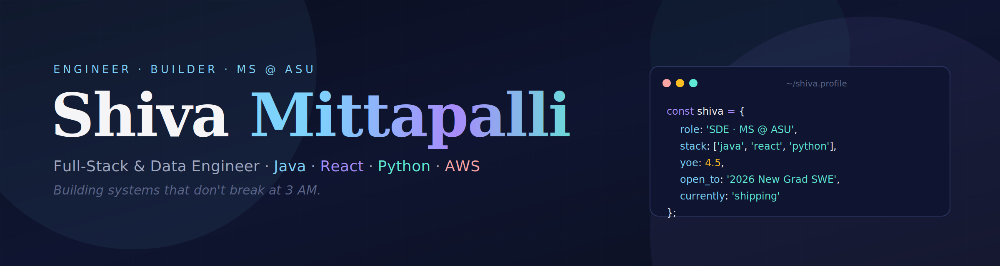

<div align="center">



<br/><br/>

[](https://www.linkedin.com/in/shiva-mittapalli/)
[](mailto:shivamittapalli7@gmail.com)
[](https://github.com/Shivanathsai)

**`Open to 2026 New Grad SWE · Full-Stack · Data · AI/ML Engineering roles in the US`**
**`F-1 STEM OPT · 3-yr work authorization · Tempe, AZ`**

</div>

---

### 👋 About

I'm a software engineer with **4.5 years of production experience** (Deloitte → UST Global, SDE III), now finishing my **MS in Software Engineering at Arizona State** (4.0 GPA, graduating Dec 2026).

I work across three lanes — **shipping full-stack products, building data platforms, and integrating AI/ML into production**. I've delivered systems serving **500K+ users at 99.9% uptime**, ML pipelines that prevented **$2M+/year in fraud**, and cut batch processing time by **87%** by re-architecting partitioning. Comfortable with the whole loop: Spring Boot APIs, React UIs, Spark jobs, RAG pipelines, and the Kubernetes manifests holding it all together.

**What I'm into right now:** real-time data infrastructure, LLM-backed services that actually work in production, and making distributed systems boring (in the good way).

---

### 🛠️ Tech Stack

<table>
<tr>
<td valign="top" width="33%">

**🔵 Full-Stack**

Java 17 · Spring Boot 3 · React 18 · Next.js · TypeScript · Node.js · PostgreSQL · MySQL · MongoDB · REST · GraphQL · gRPC

</td>
<td valign="top" width="33%">

**🟣 Data Engineering**

Python · Spark · Kafka · Airflow · Delta Lake · dbt · Snowflake · AWS EMR · AWS Glue · Redis · Pandas · NumPy

</td>
<td valign="top" width="33%">

**🟢 AI / ML**

PyTorch · LangChain · LLM / RAG · pgvector · Pinecone · OpenAI API · Anthropic API · MLflow · XGBoost · scikit-learn

</td>
</tr>
</table>

**Cloud & Infrastructure** — AWS (Lambda, S3, EMR, Glue, ECS, Cognito) · Docker · Kubernetes · Terraform · GitHub Actions
**Observability** — Prometheus · Grafana · OpenTelemetry · Datadog

---

### 📌 Featured Projects

<table>
<tr>
<td width="50%" valign="top">

#### 🔵 [Task-Flow](https://github.com/Shivanathsai/Task-Flow) — *Full-Stack*
Collaborative task manager — JWT auth via Spring Security, drag-and-drop Kanban, real-time stats dashboard, Swagger-documented API. Containerized end-to-end with Docker Compose, ECS-deployment-ready.

`Java 17` `Spring Boot 3` `React 18` `PostgreSQL` `Docker`

</td>
<td width="50%" valign="top">

#### 🟢 [ML Inference Optimizer](https://github.com/Shivanathsai/ML-Inference-Optimizer) — *AI / ML*
PyTorch inference framework — **3.2× throughput, 68% latency reduction** vs FP32. INT8 quantization (75% smaller, <1% accuracy loss), custom C++/CUDA fused kernels (ReLU + LayerNorm), DDP distributed training, FastAPI async server.

`Python` `PyTorch` `CUDA / C++` `DDP` `FastAPI`

</td>
</tr>
<tr>
<td width="50%" valign="top">

#### 🟣 [Realtime Streaming Platform](https://github.com/Shivanathsai/realtime-streaming-platform) — *Systems / Python*
Event-driven Kafka platform — **500K+ events/hr**, exactly-once semantics, 5 CEP patterns (velocity, anomaly, impossible-travel, burst, merchant-diversity), Welford's online algorithm, Redis state store, K8s with HPA on consumer lag.

`Python` `Kafka` `Redis` `PostgreSQL` `Kubernetes`

</td>
<td width="50%" valign="top">

#### 🟣 [Distributed ETL · Delta Lake](https://github.com/Shivanathsai/Distributed-ETL-Delta-Lake) — *Data Engineering*
Medallion-architecture pipeline (Bronze → Silver → Gold) processing **500GB+/day**. Delta Lake ACID, partition pruning + Z-Ordering (**60–67% faster queries**), SCD Type 2, Great Expectations validation, Terraform-provisioned AWS EMR.

`Python` `Spark` `Delta Lake` `Airflow` `AWS EMR` `Terraform`

</td>
</tr>
</table>

<details>
<summary><b>More projects worth a look →</b></summary>

<br/>

**🟠 [Event Processing Platform](https://github.com/Shivanathsai/event-processing-platform)** — Java microservices on Kafka Streams + AWS EKS. Multi-module Maven project (producer / processor / consumer), exactly-once semantics, tumbling-window aggregation, Prometheus + Grafana monitoring, Alertmanager integration.
`Java` `Spring Boot` `Kafka Streams` `AWS EKS` `Grafana`

**🟢 [LLM Code Assistant](https://github.com/Shivanathsai/llm-code-assistant)** — RAG-based code assistant over 100K+ doc lines. ChromaDB vector store, Groq LLM (llama-3.1-8b-instant), **92% accuracy** on 25-QA benchmark suite, sub-2s p99 latency, full CI accuracy gates.
`Python` `RAG` `ChromaDB` `Groq` `FastAPI`

</details>

---

### 📈 Track Record

```
🚀  Shipped full-stack systems (React + Spring Boot/Node) for 500K+ users at 99.9% uptime
⚡  Cut API p99 latency by 45% — query plan + indexing rewrites
📦  Reduced batch processing time 87% (6 hrs → 45 min) — re-architected partitioning
💰  Prevented $2M+/year in fraud — real-time ML detection pipelines
🤖  Integrated OpenAI APIs and RAG pipelines into production user-facing features
👥  Mentored 5 engineers on distributed systems design reviews
```

---

### 📊 GitHub Stats

<div align="center">


</div>

---

### 🎓 Currently

- 🎓 Wrapping up MS in Software Engineering at **Arizona State University** *(Dec 2026)*
- 🛠️ Shipping **TaskFlow** and the **LLM RAG project** as portfolio capstones
- 📚 Going deep on streaming systems, vector search, and production ML infra
- 🌎 Recruiting season — **open to 2026 New Grad SWE roles** (full-stack, data, AI/ML)

---

### 📫 Let's Talk

If you're hiring, collaborating, or just want to swap notes on distributed systems —

- 📧 [shivamittapalli7@gmail.com](mailto:shivamittapalli7@gmail.com)
- 💼 [linkedin.com/in/shiva-mittapalli](https://www.linkedin.com/in/shiva-mittapalli/)
- 🐙 [github.com/Shivanathsai](https://github.com/Shivanathsai)

<div align="center">

<br/>

***If something here caught your eye, the easiest way to say hi is the email above.***

</div>
